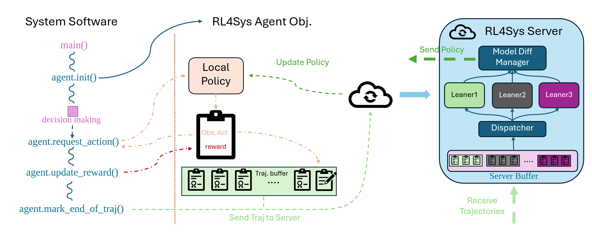

# RL4Sys: Reinforcement Learning for System Control

RL4Sys is a distributed reinforcement learning framework designed for system control applications. It provides a server-client architecture that enables multiple clients to train and share models in a distributed manner.


## Project Structure

```
RL4Sys-Dev/
├── rl4sys/                    # Main Python package
│   ├── algorithms/            # RL algorithm implementations
│   │   ├── PPO/              # Proximal Policy Optimization
│   │   │   ├── PPO.py        # PPO algorithm implementation
│   │   │   ├── kernel.py     # PPO training kernel
│   │   │   └── replay_buffer.py
│   │   └── DQN/              # Deep Q-Network
│   │       ├── DQN.py        # DQN algorithm implementation
│   │       ├── kernel.py     # DQN training kernel
│   │       └── replay_buffer.py
│   ├── client/               # Python client-side components
│   │   ├── agent.py          # RL agent implementation
│   │   ├── config_loader.py  # Configuration loader for client
│   │   └── readme.md         # Client documentation
│   ├── cppclient/            # High-performance C++ client
│   │   ├── include/          # C++ header files
│   │   ├── src/              # C++ source files
│   │   ├── examples/         # C++ examples (Lunar Lander)
│   │   ├── test/             # C++ unit tests
│   │   ├── generated_proto/  # Generated gRPC stubs
│   │   ├── CMakeLists.txt    # CMake build configuration
│   │   └── README.md         # C++ client documentation
│   ├── common/               # Shared utilities and components
│   │   ├── action.py         # Definition of RL4SysAction
│   │   └── trajectory.py     # Definition of RL4SysTrajectory
│   ├── examples/             # Example applications
│   │   ├── lunar/            # Lunar Lander example
│   │   │   ├── lunar_lander.py
│   │   │   ├── lunar_lander_dqn.py
│   │   │   └── luna_conf.json
│   │   ├── job_schedual_old/ # Job scheduling examples
│   │   │   └── HPCSim/       # HPC simulation environment
│   │   ├── test_python/      # Python client tests
│   │   └── test_cpp/         # C++ client tests
│   ├── logs/                 # Logging directory
│   ├── proto/                # Protocol buffer definitions
│   │   ├── rl4sys.proto      # gRPC proto definition
│   │   └── generate_proto.sh # Script to generate gRPC stubs
│   ├── server/               # Server-side components
│   │   ├── server.py         # Main server implementation
│   │   └── model_diff_manager.py # Model versioning and diff management
│   ├── utils/                # Utility functions
│   │   ├── conf_loader.py    # Configuration loading utilities
│   │   ├── logging_config.py # Logging configuration
│   │   ├── plot.py           # Plotting utilities
│   │   ├── system_monitor.py # System monitoring utilities
│   │   └── util.py           # General utilities
│   ├── start_server.py       # Server startup script
│   └── __init__.py           # Package initialization
├── examples/                 # Top-level examples
│   ├── job-scheduling/       # Job scheduling examples
│   │   └── scheduler.py
│   └── profiling_lunar/      # Performance profiling examples
│       ├── baseline_main.py
│       ├── rllib/            # RLlib integration examples
│       └── torchrl/          # TorchRL integration examples
├── grpc_test/                # gRPC testing utilities
│   ├── client.cpp
│   ├── server.cpp
│   ├── helloworld.proto
│   └── CMakeLists.txt
├── docs/                     # Documentation
│   └── <doc pngs>
├── setup.py                  # Package setup configuration
├── config.json               # Global configuration
└── README.md                 # This file
```

## Features

- Distributed training architecture with server-client model
- Support for multiple RL algorithms (PPO, DQN)
- Efficient model versioning and diff management
- Client-specific training threads
- Protocol buffer-based communication
- Comprehensive logging system
- Example implementations for system control tasks

## Installation

1. Clone the repository:
```bash
git clone https://github.com/yourusername/RL4Sys.git
cd RL4Sys
```

2. Install dependencies:
```bash
pip install -r requirements.txt
```

## Quick Start

### Starting the Server

```bash
cd rl4sys
python start_server.py --debug
```

### Running the Lunar Lander Example

The Lunar Lander example demonstrates how to use RL4Sys with the Gymnasium Lunar Lander environment:

```bash
cd rl4sys/examples/lunar
python lunar_lander.py --debug
```

### See the training progress

The training logs are stored in 
```bash
cd rl4sys/logs
tensorboard --logdir rl4sys-ppo-info
```

## Configuration

The Lunar Lander example uses a configuration file (`luna_conf.json`) to specify:
- Algorithm parameters
- Network architecture
- Training hyperparameters
- Communication settings

Example configuration:
```json
{
    "client_id": "luna-landing",
    "algorithm_name": "PPO",
    "algorithm_parameters": {
        "batch_size": 512,
        "act_dim": 4,
        "seed": 0,
        "traj_per_epoch": 256,
        "clip_ratio": 0.2,
        "gamma": 0.99,
        "lam": 0.95,
        "pi_lr": 3e-4,
        "vf_lr": 1e-3,
        "train_pi_iters": 80,
        "train_v_iters": 80,
        "target_kl": null,
        "input_size": 8
    },
    "act_limit": 1.0,
    "max_traj_length": 1000,
    "type": "onpolicy",
    "train_server_address": "localhost:50051",
    "send_frequency": 10
}
```

## How It Works

### Server Architecture

The RL4Sys server implements a client-specific training approach:

1. Each client gets its own:
   - Algorithm instance
   - Training thread
   - Model version manager
   - Training queue

2. A central dispatcher thread:
   - Receives trajectories from all clients
   - Routes them to the appropriate client's training queue

3. Client-specific training threads:
   - Process trajectories from their dedicated queue
   - Update their algorithm's model
   - Manage model versioning

### Client Implementation

The Lunar Lander example shows how to implement a client:

1. Initialize the RL4Sys agent:
```python
self.rlagent = RL4SysAgent(conf_path='./luna_conf.json')
```

2. Run the training loop:
```python
def run_application(self, num_iterations, max_moves):
    for iteration in range(num_iterations):
        obs, _ = self.env.reset(seed=self._seed + iteration)
        done = False
        moves = 0
        
        while not done and moves < max_moves:
            # Get action from agent
            self.rl4sys_traj, self.rl4sys_action = self.rlagent.request_for_action(
                self.rl4sys_traj, obs_tensor
            )
            
            # Execute action and get reward
            next_obs, reward, terminated, truncated, _ = self.env.step(action)
            
            # Update trajectory
            self.rlagent.add_to_trajectory(self.rl4sys_traj, self.rl4sys_action)
            self.rl4sys_action.update_reward(reward)
```

### Python API Documentation

The Rl4Sys Python API's are listed as following:

#### `class RL4SysAgent`
```python
RL4SysAgent(conf_path: str, debug: bool)
```
Creates a lightweight client that opens (or re-uses) a gRPC/TCP connection to the RL4Sys trainer.
All behavioural details—server address, authentication token, rollout-buffer size, policy id, etc.—are taken from the JSON/YAML file referenced by conf_path

#### Parameters

| name        | type  | description                                                               |
| ----------- | ----- | ------------------------------------------------------------------------- |
| `conf_path` | `str` | Absolute or relative path to a RL4Sys **client-side** configuration file. |
| 'debug'     |'bool' | Whether to enable debug logging                             |

#### `RL4SysAgent.request_for_action`

```python
request_for_action(
    traj: Optional[RL4SysTrajectory],
    obs:  torch.Tensor | np.ndarray | list[float]
) -> tuple[RL4SysTrajectory, RL4SysAction]
```
Synchronously forwards the latest observation to the remote policy and returns:
A trajectory handle – either the one you passed in (updated in-place) or a brand-new RL4SysTrjectory object if you passed None.
An RL4SysAction object embedding the chosen action plus bookkeeping fields.
Internally the call stores (obs, t_step) in the trajectory so the learner can later compute returns/advantages.

#### Parameters
| name   | type                  | description                                                                                                                       |                
| ------ | --------------------- | --------------------------------------------------------------------------------------------------------------------------------- | 
| `traj` | RL4SysTrajectory    | Existing trajectory handle or `None` to start a new episode.                                                                        |
| `obs`  | tensor / array / list | Observation for the **current** environment state. Must match the dimensionality expected by the model configured in `conf_path`. |        

#### Returns
Tuple (traj, action) where:
traj – same type as input, now containing the new step.
action – instance of RL4SysAction exposing .act and other helpers.

#### `RL4SysAgent.add_to_trajectory`
```python
add_to_trajectory(traj: RL4SysTrajectory,
                  action: RL4SysAction) -> None
```
Adds the action (and any metadata you have updated on it) to RL4SysTrajectory.
Call this once per env step, right after request_for_action and before executing the next call.
#### Parameters
| name     | type               | description                                        |
| -------- | ------------------ | -------------------------------------------------- |
| `traj`   | `RL4SysTrajectory` | The trajectory obtained from `request_for_action`. |
| `action` | `RL4SysAction`     | The action object you just executed.               |

#### Returns
None (in-place side effects only).

#### `RL4SysAgent.mark_end_of_trajectory`
```python
mark_end_of_trajectory(
    traj: RL4SysTrajectory,
    action: RL4SysAction
) -> None
```
Flags the terminal step so the learner can finish computing returns and discard server-side state for this episode.
Call when the environment terminates/truncates or when you enforce a fixed horizon.

#### Parameters
| name     | type             | description                                         |
| -------- | ---------------- | --------------------------------------------------- |
| `traj`   | RL4SysTrajectory | The running trajectory.                             |
| `action` | RL4SysAction     | Final step's action object (with reward filled in). |

#### Returns
None 

#### `RL4SysAction.update_reward`
```python
RL4SysAction.update_reward(reward: float) -> None
```
Attaches the scalar reward obtained for this step to the action.
Invoke once between env.step and the next request_for_action (or before mark_end_of_trajectory on the last step).

#### Parameters
| name     | type  | description                            |
| -------- | ----- | -------------------------------------- |
| `reward` | float | Immediate reward from the environment. |

#### Returns
None 


## Contributing

Contributions are welcome! Please feel free to submit a Pull Request.

## License

This project is licensed under the MIT License - see the LICENSE file for details.
