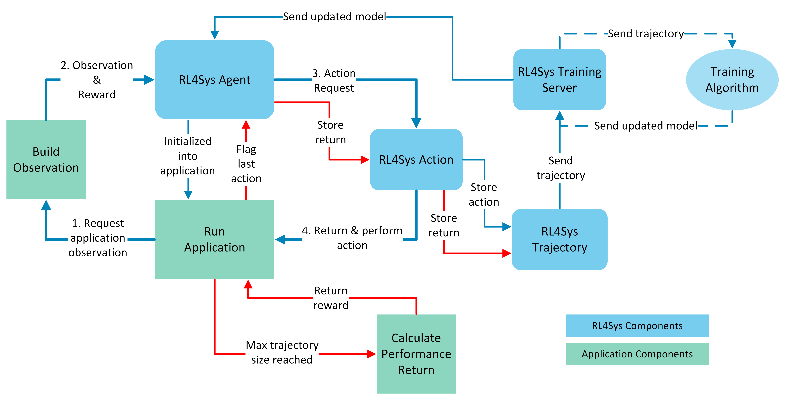

# RL4Sys, a Framework for Reinforcement Learning Optimization

Before use, the user _must_ ensure they adhere to and implement the `ApplicationAbstract` class and its methods to create an environment capable of providing RL4Sys with observations and rewards/performance returns. The `RL4SysAgent` will be initialized into the main loop of this environment through `run_application()`.
## RL4Sys Main loop

1. **Request application observation**
2. **Observation & Reward**
3. **Action Request**
4. **Return & Perform Action**

**Repeat**

# RL4Sys Components

User is able to use the existing RL4Sys components or create their own components by extending the abstract classes found in `_common`.
### Agent
- `RL4SysAgent` or
- `RL4SysAgentAbstract` 

### Action
- `RL4SysAction` or
- `RL4SysActionAbstract`
    
### Trajectory
- `RL4SysTrajectory` or
- `RL4SysTrajectoryAbstract`
    
### Training Server
- `RL4SysTrainingServer` or
- `RL4SysTrainingServerAbstract`
    
### Training Algorithm
- `PPO`, `TRPO`, `DQN`, `SAC`, `C51` or
- algorithm abstract components, see [Customizablility](#Customizability)
    

# Application Components

User is able to create their own application components by extending the abstract class `BaseApplication.py` found in `_common`. The `examples` folder contains example applications that show how to implement the `BaseApplication` class.

### Run Application
- `run_application()`
### Build Observation
- `build_observation()`
### Calculate Performance Return
- `calculate_performance_return()`

# Agent APIs

The loop of using RL4Sys agent

1. First, users implement observation.
2. Second, call action() to get output of

a1 = agent.action(obv)
a1 = agent.action_with_mask(obv)

`action()` returns a RL4SysAction instance and users need to interpret it.

* a1.action()
* a1.prob()
* a1.logprob()
* a1.reward() to report the rewards.

3. Third, store the interaction into Reply Buffer.

4. Third, determine if a trajectory is done based on the systems' own logic.

RL4SysReplayBuffer() instance
buff.store(RLSysAction)

if traj is done
buff.finish_traj(RLSysAction)

if done:
reset()

# Customizability

RL4Sys is designed to be highly flexible to the user's needs. 

Configuration of RL4Sys occurs in the root directory's `config.json`. This includes configurable parameters for RL4Sys training and algorithm hyperparameters.

By using template classes and common functions found in `_common`, the user can easily implement their own applications, algorithms, and RL4Sys components.

`_common` contains the following abstract classes and functions:
- `_algorithm`
  - `BaseKernel.py`
    - ForwardKernelAbstraction(nn.Module, ABC)
    - StepKernelAbstract(nn.Module, ABC)
    - StepAndForwardKernelAbstract(nn.Module, ABC)
    - infer_next_obs(act, obs, mask=None)
    - mlp(sizes, activation, output_activation=nn.Identity)
  - `BaseReplayBuffer.py`
    - ReplayBufferAbstract(ABC)
    - combined_shape(length, shape=None)
    - discount_cumsum(x, discount)
    - statistics_scalar(x, with_min_and_max=False)
  - `BaseAlgorithm.py`
    - AlgorithmAbstract(ABC)
- `_examples`
  - `BaseApplication.py`
    - ApplicationAbstract(ABC)
- `_rl4sys`
  - `BaseTrajectory.py`
    - RL4SysTrajectoryAbstract(ABC)
    - send_trajectory(trajectory)
    - serialize_trajectory(trajectory)
  - `BaseAgent.py`
    - RL4SysAgentAbstract(ABC)
  - `BaseTrainingServer.py`
    - RL4SysTrainingServerAbstract(ABC)
  - `BaseAction.py`
    - RL4SysActionAbstract(ABC)

# Installation Notes
If using python 3.7 or earlier, you will need to install pickle as it is not included as part of the python standard library until python 3.8
You can uncomment the lines for pickle in setup.py or requirements.txt