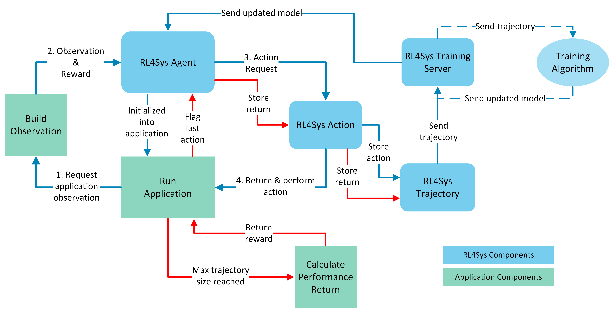

# RL4Sys: A Framework for Reinforcement Learning Optimization




## Installation

### Development Installation
```bash
# Clone the repository
git clone https://github.com/your-org/RL4Sys.git
cd RL4Sys

# Install in development mode
pip install -e .
```

### Regular Installation
```bash
pip install rl4sys
```

## Project Structure
```
RL4Sys/
├── rl4sys/                  # Main package directory
│   ├── __init__.py         # Package initialization
│   ├── algorithms/         # RL algorithm implementations
│   ├── client/            # Client-side components
│   ├── server/            # Server components
│   ├── utils/             # Utility functions
│   ├── protocol/          # gRPC protocol definitions
│   ├── _common/           # Common abstract base classes
│   └── examples/          # Example applications
├── docs/                   # Documentation
├── tests/                  # Test suite
├── setup.py               # Package setup file
├── requirements.txt       # Development requirements
└── README.md             # This file
```

## Usage

Before use, implement the `ApplicationAbstract` class and its methods to create an environment capable of providing RL4Sys with observations and rewards/performance returns. The `RL4SysAgent` will be initialized into the main loop of this environment through `run_application()`.

### Main Loop
1. Request application observation
2. Observation & Reward
3. Action Request
4. Return & Perform Action
5. Repeat

## Components

Users can use existing RL4Sys components or create their own by extending the abstract classes found in `_common`.

### Available Components
- Agent: `RL4SysAgent` or `RL4SysAgentAbstract`
- Action: `RL4SysAction` or `RL4SysActionAbstract`
- Trajectory: `RL4SysTrajectory` or `RL4SysTrajectoryAbstract`
- Training Server: `RL4SysTrainingServer` or `RL4SysTrainingServerAbstract`

### Supported Algorithms
- PPO (Proximal Policy Optimization)
- TRPO (Trust Region Policy Optimization)
- DQN (Deep Q-Network)
- SAC (Soft Actor-Critic)
- C51 (Categorical 51-Atom)
- DDPG (Deep Deterministic Policy Gradient)
- TD3 (Twin Delayed DDPG)
- RPO (Regularized Policy Optimization)

## Configuration

Configuration is handled through `config.json` in the root directory. This includes:
- Algorithm hyperparameters
- Server settings
- Model paths
- TensorBoard settings

## Examples

Check the `rl4sys/examples/` directory for implementation examples:
- Lunar Lander
- Maze Game
- Job Scheduling

## License

MIT License - see LICENSE file for details

# RL4Sys Main loop

1. **Request application observation**
2. **Observation & Reward**
3. **Action Request**
4. **Return & Perform Action**

**Repeat**

# RL4Sys Components


User is able to use the existing RL4Sys components or create their own components by extending the abstract classes found in `_common`.
### Agent
- `RL4SysAgent` or
- `RL4SysAgentAbstract` 

### Action
- `RL4SysAction` or
- `RL4SysActionAbstract`
    
### Trajectory
- `RL4SysTrajectory` or
- `RL4SysTrajectoryAbstract`
    
### Training Server
- `RL4SysTrainingServer` or
- `RL4SysTrainingServerAbstract`
    
### Training Algorithm
- `PPO`, `TRPO`, `DQN`, `SAC`, `C51` or
- algorithm abstract components, see [Customizablility](#Customizability)
    

# Application Components


User is able to create their own application components by extending the abstract class `BaseApplication.py` found in `_common`. The `examples` folder contains example applications that show how to implement the `BaseApplication` class.

### Run Application
- `run_application()`
### Build Observation
- `build_observation()`
### Calculate Performance Return
- `calculate_performance_return()`

# Agent APIs

The loop of using RL4Sys agent

1. First, users implement observation.
2. Second, call action() to get output of

a1 = agent.action(obv)

`action()` returns a RL4SysAction instance and users need to interpret it.

* a1.action()
* a1.prob()
* a1.logprob()
* a1.reward() to report the rewards.

3. Third, store the interaction into Reply Buffer.


4. Third, determine if a trajectory is done based on the systems' own logic.


RL4SysReplayBuffer() instance
buff.store(RLSysAction)

if traj is done
buff.finish_traj(RLSysAction)

if done:
reset()

# Customizability


RL4Sys is designed to be highly flexible to the user's needs. 

Configuration of RL4Sys occurs in the root directory's `config.json`. This includes configurable parameters for RL4Sys training and algorithm hyperparameters.

By using template classes and common functions found in `_common`, the user can easily implement their own applications, algorithms, and RL4Sys components.

`_common` contains the following abstract classes and functions:
- `_algorithm`
  - `BaseKernel.py`
    - ForwardKernelAbstraction(nn.Module, ABC)
    - StepKernelAbstract(nn.Module, ABC)
    - StepAndForwardKernelAbstract(nn.Module, ABC)
    - infer_next_obs(act, obs)
    - mlp(sizes, activation, output_activation=nn.Identity)
  - `BaseReplayBuffer.py`
    - ReplayBufferAbstract(ABC)
    - combined_shape(length, shape=None)
    - discount_cumsum(x, discount)
    - statistics_scalar(x, with_min_and_max=False)
  - `BaseAlgorithm.py`
    - AlgorithmAbstract(ABC)
- `_examples`
  - `BaseApplication.py`
    - ApplicationAbstract(ABC)
- `_rl4sys`
  - `BaseTrajectory.py`
    - RL4SysTrajectoryAbstract(ABC)
    - send_trajectory(trajectory)
    - serialize_trajectory(trajectory)
  - `BaseAgent.py`
    - RL4SysAgentAbstract(ABC)
  - `BaseTrainingServer.py`
    - RL4SysTrainingServerAbstract(ABC)
  - `BaseAction.py`
    - RL4SysAction(ABC)

# Execute Script (temporary)

D: & cd D:\Projects\0_Udel\RL4Sys & conda activate udel

python examples/maze-game/maze.py -s SAC

python examples/maze-game/maze.py -s PPO

python examples/maze-game/maze.py -s DQN

## debuging ##
python examples/maze-game/maze.py -s PPO --number-of-moves 5000

python examples/maze-game/maze.py -s PPO --number-of-moves 5000 --number-of-iterations 100
# 10 iteration lead to error


## Tensorboard ## 
tensorboard --logdir examples/maze-game/logs

# tensor board have bug on epoch writing